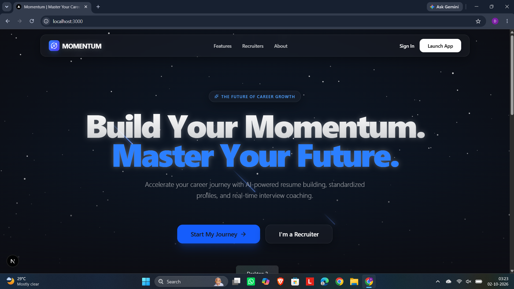
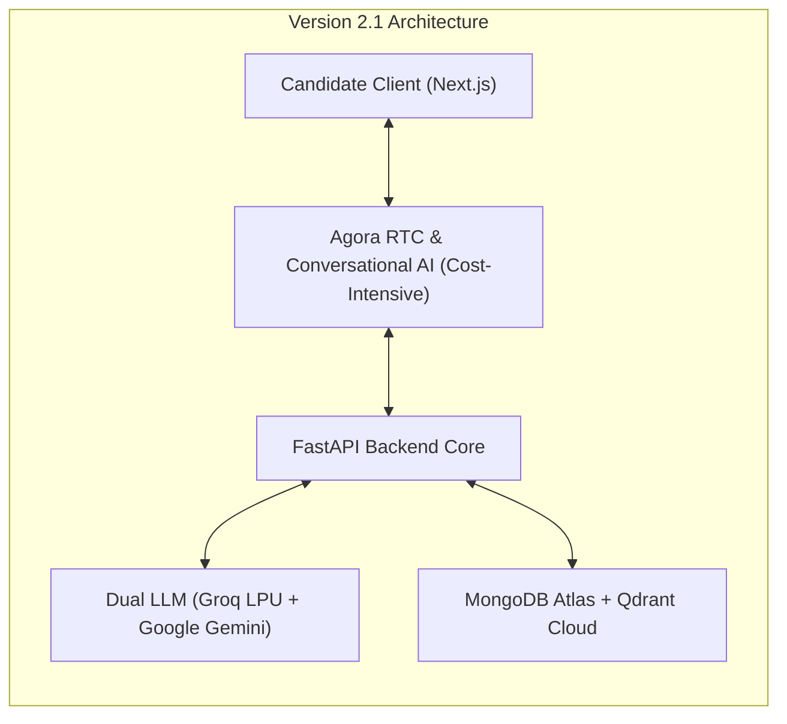
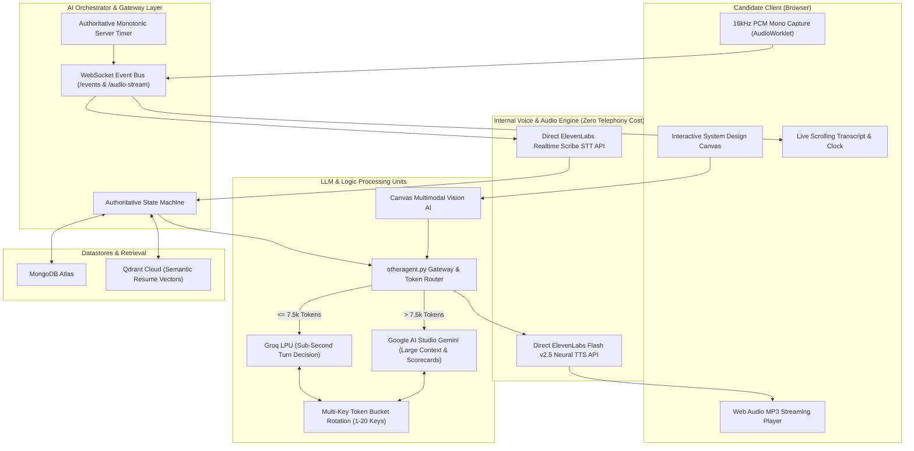
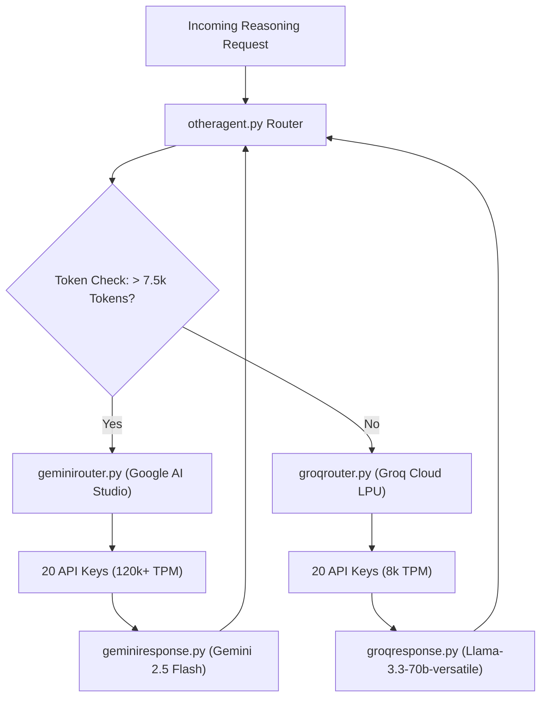

# Momentum V2: Autonomous Multi-Agent AI Recruitment and Live Voice Interview Platform

[](https://youtu.be/L0X71raKuLc?si=E0k-VsISpUQmNBFF)

- **Live Product Demonstration Video**: [https://youtu.be/L0X71raKuLc?si=E0k-VsISpUQmNBFF](https://youtu.be/L0X71raKuLc?si=E0k-VsISpUQmNBFF)

---

## Public Showcase Repository Notice

This repository serves as the official public showcase, architectural specification, and technical documentation hub for **Momentum V2**.

To safeguard proprietary intellectual property, multi-agent arbitration algorithms, and production weights against unauthorized duplication, the full production source codebases (FastAPI backend and Next.js frontend) are hosted in private repositories.

This repository provides comprehensive architectural blueprints, system design specifications, multi-agent cognitive workflows, API contracts, data schemas, and video demonstrations for recruiters, engineering hiring panels, and technical evaluators.

**Recruiter & Evaluator Code Access**: Full access to the underlying implementation repositories is available upon direct request. Please contact the author via GitHub or email.

---

## Executive Overview: An Autonomous Agentic Recruitment Ecosystem

Traditional technical hiring platforms rely on robotic keyword matching, static multiple-choice questionnaires, or single-turn chatbot prompts. **Momentum V2** redefines technical evaluation as a **fully autonomous Multi-Agent System (MAS)**.

In Momentum, interview panels and questions are **not hardcoded or predefined**:
1. **Dynamic Runtime Panel Generation**: When an interview is initiated, the orchestrator generates a bespoke panel of 1 to 5 specialized interviewer personas tailored to the specific role and candidate seniority.
2. **Autonomous Turn-by-Turn Decision Cycle**:
   - **Step 1 (Continuation Decision)**: Evaluates the candidate's latest response against the entire transcript history to decide whether to **CONTINUE**, **CONCLUDE** (early termination if inadequate or criteria met), or **DRAW** (trigger System Design Canvas).
   - **Step 2 (Competency Direction)**: Evaluates remaining uncovered competencies and selects the next topic area, project claim, or skill.
   - **Step 3 (Question Generation)**: Directly formulates a natural, second-person spoken interview question probing that direction.
   - **Step 4 (Dynamic Speaker Selection)**: Evaluates all generated panel members against the new question and selects who should ask it based on their assigned evaluation focus.
   - **Step 5 (Voice Delivery & State Update)**: Delivers synthesized neural audio using that member's unique ElevenLabs voice profile.
3. **Multimodal Architecture Canvas**: Evaluates live hand-drawn system topology diagrams using multimodal vision.
4. **Evidence-Based Reflection**: Synthesizes multi-dimensional scorecards grounded in exact transcript quotes.

---

## Evolution: Version 2.1 vs Version 2.2

### Strategic Shift: Eliminating Agora Infrastructure Costs for Direct ElevenLabs Implementation

In Version 2.1, audio streaming was routed through Agora Conversational AI and Agora RTC. While functional, this introduced significant per-minute telecommunication service costs, intermediary bridging latency, and external gateway dependencies.

In **Version 2.2**, Momentum transitioned to a **direct, high-performance internal voice pipeline**:
- **Zero Agora Telephony Overhead**: Eliminated Agora vendor infrastructure costs completely by capturing audio directly in the browser via native HTML5 Web Audio API (`AudioWorklet` streaming 16kHz mono PCM) and relaying it through FastAPI WebSockets.
- **Direct ElevenLabs Integration**: Powered by ElevenLabs Scribe Realtime STT (`scribe_v2_realtime`) and Flash v2.5 Neural TTS (`eleven_flash_v2_5`), resulting in lower latency, richer conversational cadences, and instant client-side barge-in buffer flushing.
- **Enhanced LLM Cognitive Reasoning**: Re-engineered the decision-making brain in Version 2.2 to perform continuation checks before every question, multi-key token-bucket rotation (1 to 20 keys per provider), and multimodal vision evaluation of system design drawings.

---

### 1. Version 2.1 Architecture (Foundation Architecture)




---

### 2. Version 2.2 Enterprise Architecture (No-Agora Internal Pipeline)




---

### 3. Multi-Agent LLM Routing Hierarchy (`otheragent.py`)




---

## Core Pillars of Agentic AI Engineering

1. **Autonomous Perception and Goal Tracking**: Listens continuously via 16kHz PCM Web Audio, transcribes utterances via real-time STT, and tracks covered vs uncovered competencies against the target role's rubric.
2. **Dynamic Runtime Team Formation**: Instantiates 1 to 5 specialized interviewer agents on the fly based on candidate seniority and job criteria.
3. **Turn-by-Turn Inter-Agent Arbitration**: Agents negotiate turn-taking based on question content. If a candidate provides a technical answer that ignores customer experience, the Lead Technical Architect hands the floor to the Product Manager to challenge customer transaction consistency.
4. **Self-Directed Ambiguity & Contradiction Probing**: Detects buzzwords, vague explanations, and contradictory claims, formulating pointed follow-ups rather than moving along a fixed questionnaire.
5. **Multimodal Tool Execution**: Invokes a multimodal vision tool to evaluate hand-drawn microservice diagrams and uses Qdrant vector retrieval to ground questions in the candidate's actual career projects.
6. **Reflection and Evidence-Based Decision**: Analyzes the entire transcript to generate multi-dimensional scorecards with exact quote citations justifying hire or reject decisions.

---

## Repository Directory Structure

```text
momentum-v2/
|
|-- README.md                         # Master showcase overview & technical documentation
|-- LICENSE                           # MIT License with showcase disclosures
|-- SECURITY.md                       # Security policies, zero credential exposure & privacy
|-- .gitignore                        # Standard ignore rules
|
|-- docs/
|   |-- architecture.md               # Deep architectural comparison (V2.1 vs V2.2)
|   |-- system-design.md              # Latency analysis, token-bucket rotation & timer design
|   |-- agent-workflow.md             # Multi-agent cognitive decision loop & arbitration
|   |-- interview-flow.md             # Adaptive 6-stage lifecycle progression
|   `-- screenshots/                  # Categorized screenshot galleries
|       |-- landing-and-auth/         # Landing hero, feature overview, sign-in
|       |-- candidate-portal/         # Job search, applications, resume parsing
|       |-- interview-room/           # Pre-flight lobby, multi-voice turns, canvas
|       |-- coding-and-canvas/        # Live coding & interactive drawing environments
|       `-- recruiter-dashboard/      # Job creation, candidate leaderboard & scorecards
|
|-- demo/
|   |-- demo-video.md                 # Demo video link & timestamped walkthrough
|   |-- demo-video-preview.png        # Video preview banner card
|   `-- screenshots/                  # High-resolution video frame captures
|
|-- architecture/
|   |-- v2-1-system-architecture.png  # Version 2.1 WebRTC / Agora foundation architecture
|   |-- v2-2-system-architecture.png  # Version 2.2 Enterprise No-Agora architecture
|   `-- llm-routing-hierarchy.png     # Multi-Agent LLM routing hierarchy (Groq vs Gemini)
|
|-- examples/
|   |-- sample-job.json               # Requisition payload & interview configuration
|   |-- sample-resume.json            # Candidate profile, skill matrix & project history
|   `-- sample-interview.json         # Session execution trace, panel config & final report
|
`-- api/
    `-- README.md                     # REST endpoints, WebSocket schemas & HTTP status codes
```

---

## Platform Visual Tour

### 1. Candidate Application & Pre-Flight Lobby

*Pre-flight device lobby verifying microphone input levels, webcam feed, and disclosing AI evaluation.*

### 2. Multi-Persona Live Interview Turns

*Lead Technical Interviewer probing distributed caching invalidation with real-time speech synthesis.*

### 3. Interactive System Design Canvas

*Interactive canvas for sketching distributed system topologies evaluated by the Multimodal Vision Engine.*

### 4. Recruiter Leaderboard & Ranked Candidate Results

*Recruiter dashboard arranging all interviewed candidates in strictly descending order of their overall match score.*


*Multi-dimensional candidate scorecard detailing strengths, concerns, and hire recommendations backed by quotes.*

---

## Technology Stack

| Layer | Technologies | Role & Purpose |
|---|---|---|
| **Backend Framework** | Python 3.12, FastAPI, Uvicorn | Asynchronous REST endpoints, state management, and WebSocket hubs |
| **Frontend Portal** | Next.js 14, React, TypeScript | Candidate portal, recruiter dashboard, and real-time interview room |
| **Styling & Components** | Tailwind CSS, Lucide Icons | Responsive UI, audio telemetry monitors, and canvas styling |
| **Speech-to-Text (STT)** | ElevenLabs Realtime Scribe (`scribe_v2_realtime`) | Sub-second streaming candidate voice transcription |
| **Text-to-Speech (TTS)** | ElevenLabs Flash v2.5 (`eleven_flash_v2_5`) | Low-latency neural voice synthesis across 21+ personas |
| **Fast Reasoning Brain** | Groq LPU Inference (Llama-3.3-70b-versatile) | Sub-second conversational turn generation (<= 7,500 tokens) |
| **Deep Reasoning Engine** | Google AI Studio Gemini (Gemini 2.5 Flash) | Large-context resume ingestion and final report synthesis (> 7,500 tokens) |
| **Primary Datastore** | MongoDB, Motor (Async Driver), PyMongo | Persistence for jobs, candidate applications, transcripts, and scorecards |
| **Vector Database** | Qdrant Cloud Client | Semantic indexing of candidate resume chunks for RAG context retrieval |
| **Document Processing** | PyMuPDF (`fitz`), `python-docx` | Text and section extraction from candidate PDF and DOCX resumes |
| **Audio Processing** | Web Audio API, `AudioWorklet` | Client-side 16kHz mono PCM capture, volume metering, and MP3 streaming |

---

## Documentation Index

- [Comprehensive Architecture: V2.1 vs V2.2](docs/architecture.md)
- [Multi-Agent Cognitive Reasoning & Workflow](docs/agent-workflow.md)
- [System Design and Engineering Principles](docs/system-design.md)
- [Adaptive Interview Lifecycle Stages](docs/interview-flow.md)
- [API & WebSocket Protocol Specification](api/README.md)
- [Product Demo Video Walkthrough](demo/demo-video.md)
- [Sample Job Configuration Payload](examples/sample-job.json)
- [Sample Candidate Resume Payload](examples/sample-resume.json)
- [Sample Complete Interview Trace & Scorecard](examples/sample-interview.json)
- [Security Policy & Credential Isolation](SECURITY.md)

---

## Contact and Recruiter Inquiries

For technical evaluations, code review access, or inquiries regarding Momentum V2:

- **Author**: Dhruv Kajare
- **Email**: [kajaredhruv3@gmail.com](mailto:kajaredhruv3@gmail.com)
- **LinkedIn**: [https://www.linkedin.com/in/dhruv-kajare-b060b0260/](https://www.linkedin.com/in/dhruv-kajare-b060b0260/)
- **GitHub**: [@kajaredhruv433](https://github.com/kajaredhruv433)
- **Live Video Demonstration**: [https://youtu.be/L0X71raKuLc?si=E0k-VsISpUQmNBFF](https://youtu.be/L0X71raKuLc?si=E0k-VsISpUQmNBFF)
