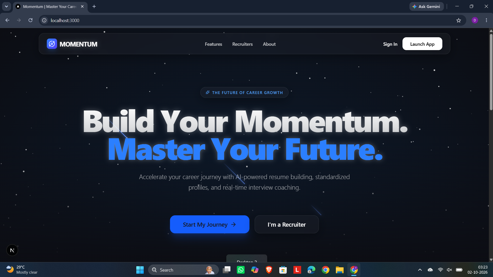
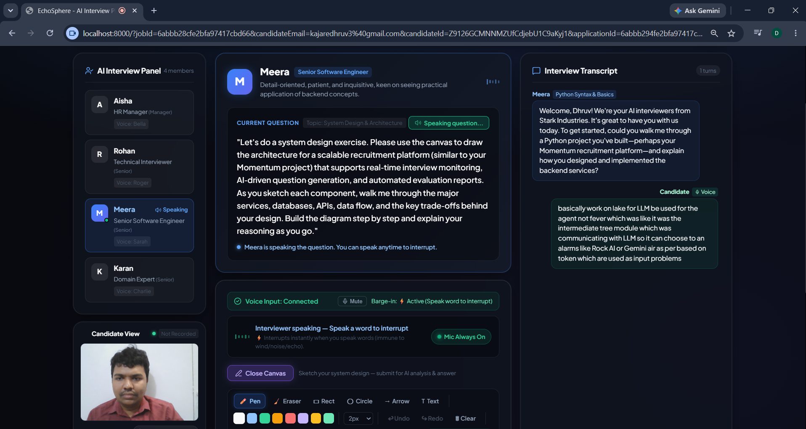
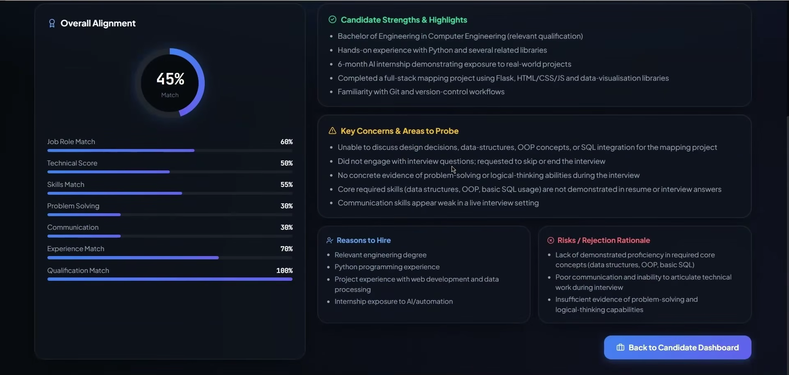

# Momentum V2 Product Demonstration

## Live Demonstration Video

Watch the complete end-to-end platform demonstration of Momentum V2:

- **Direct YouTube Link**: [https://youtu.be/L0X71raKuLc?si=E0k-VsISpUQmNBFF](https://youtu.be/L0X71raKuLc?si=E0k-VsISpUQmNBFF)

---

## Detailed Video Walkthrough Breakdown

### 1. Platform Overview & Landing Experience (0:00 - 0:45)

- Demonstration of the unified recruitment platform for candidates and hiring managers.
- Explains the core mission: replacing rigid, robotic screening forms with dynamic, voice-enabled AI panels.

### 2. Pre-Flight Device Lobby & Verification (0:45 - 1:30)

- Real-time hardware check: webcam feed preview and Web Audio API microphone volume meter.
- Prominent disclosure of autonomous AI panel evaluation.

### 3. Dynamic Multi-Persona Panel & Turn-Taking (1:30 - 3:15)

- Instantiation of dynamic panel members (HR Specialist Bella, Lead Technical Architect Charlie, Product Manager Laura).
- Real-time conversational turn-taking with natural cadence, context sharing, and neural voice synthesis.
- Demonstration of low-latency speech transcription and barge-in interruption handling.

### 4. Interactive System Design Canvas with Multimodal Vision (3:15 - 4:45)

- Live candidate architectural sketching (microservices, Redis caches, queues, and PostgreSQL).
- Backend base64 submission and automated multimodal vision evaluation identifying components and scalability bottlenecks.

### 5. Recruiter Candidate Leaderboard & Scorecards (4:45 - End)

- Post-interview automatic scorecard compilation saved directly into MongoDB.
- Recruiter dashboard displaying all candidates sorted in strictly descending order of their overall match score.
- In-depth drill-down into candidate strengths, concerns, and transcript-linked hire/reject justifications.
