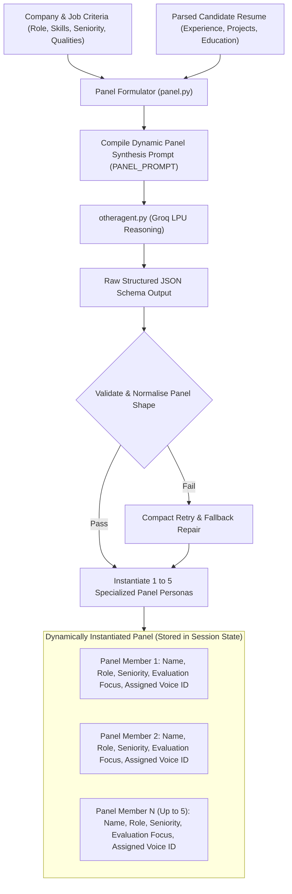
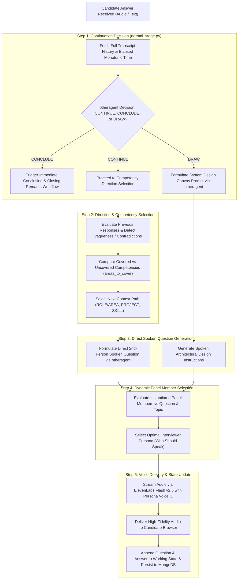
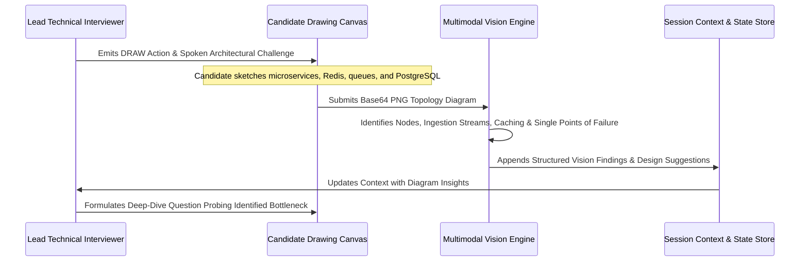
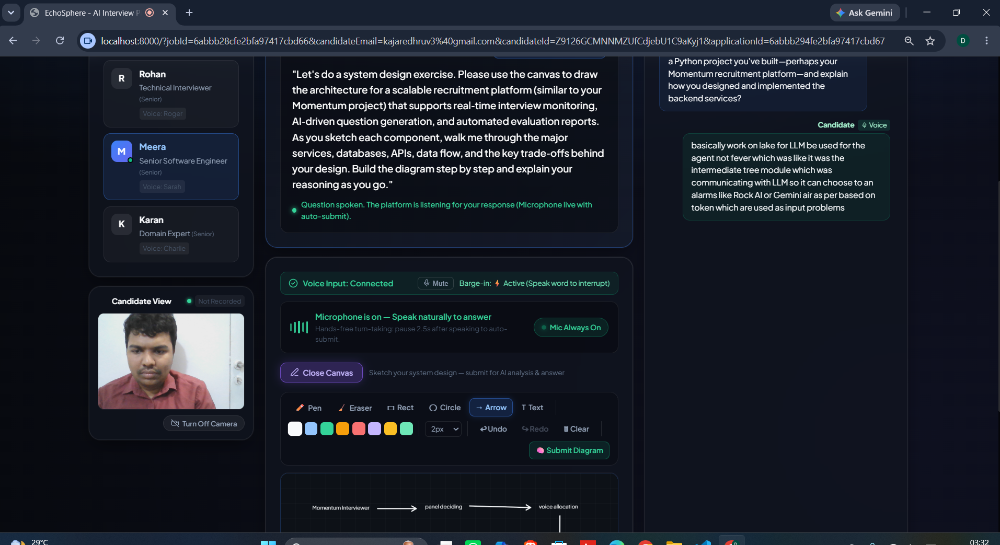

# Agentic AI Architecture: Autonomous Multi-Agent Cognitive Engine

## Executive Overview: Why Momentum is Purely Agentic

Conventional interview platforms rely on static question scripts, hardcoded bots, or naive single-turn prompts. In contrast, **Momentum V2** is architected as an **Autonomous Multi-Agent System (MAS)** where interview panels, evaluation strategies, and conversation steering are computed dynamically at runtime.

The system does not follow a predefined question list. After every candidate response, the reasoning engine analyzes the complete transcript history, makes an autonomous decision on whether to continue the interview, determines what competency to probe next, formulates the exact spoken question, and selects the optimal interviewer persona to deliver it.


---

## 1. On-Demand Dynamic Panel Generation (1 to 5 Members)

Interview panels and their respective roles are **not predefined or hardcoded**. When an interview session is initiated, our orchestrator prompts the reasoning engine (`panel.py`) with the job criteria and candidate profile to synthesize a bespoke committee of 1 to 5 interviewers.



### Runtime Generation Parameters
For every generated panel member, the system dynamically assigns:
- **Name & Persona**: Human identity, communication style, and personality.
- **Role & Seniority**: Contextual job title tailored specifically to the target role (e.g., Senior Infrastructure Architect, Lead Frontend Engineer, Group Product Manager, Culture Fit Evaluator).
- **Interview Stage & Responsibility**: Specific phase ownership (e.g., Technical Deep Dive, System Design, Behavioral Fit).
- **Evaluation Focus**: Distinct non-overlapping list of competencies and technical domains to assess.
- **Behavioral Guidelines**: Specific rules on questioning style, depth, and tone.
- **Assigned Neural Voice**: Dedicated ElevenLabs voice profile from the catalog (`voice.py`).

---

## 2. Real-Time Turn-by-Turn Cognitive Decision Cycle

Every conversational turn in Momentum follows a deterministic yet highly adaptive 5-step multi-agent decision cycle:



---

## 3. Deep Dive into the 5-Step Execution Cycle

### Step 1: Autonomous Continuation Decision (Continue vs Conclude vs Draw)
Before formulating any new question, the reasoning engine (`normal_stage.py`, `extended_stage.py`, `final_stage.py`) executes a continuation evaluation:
- **CONCLUDE Decision**: If the candidate's answers demonstrate that the candidate is completely unqualified, or if all evaluation milestones are satisfied, the engine triggers an early conclusion rather than wasting interview time.
- **DRAW Decision**: If an architectural design assessment is required, the engine diverts to the System Design Canvas workflow.
- **CONTINUE Decision**: If further assessment is warranted, the engine proceeds to generate the next question.

### Step 2: Evaluation of Previous Answers & Direction Selection
The engine evaluates the candidate's latest response in the context of the entire previous history:
- **Vagueness Detection**: If the candidate provided a generic answer without implementation mechanics, the engine steers the direction to probe that exact claim.
- **Contradiction Identification**: If the candidate makes claims conflicting with earlier statements, the engine flags the discrepancy.
- **Competency Gap Tracking**: Compares covered areas against required competencies to select the next topic area, resume project, or skill.

### Step 3: Direct Spoken Question Generation
`otheragent.py` directly formulates the spoken question in second-person conversational phrasing tailored to the active lifecycle stage (`Normal`, `Extended`, `Final`), ready for immediate speech synthesis.

### Step 4: Dynamic Speaker Selection (Who Will Ask)
Rather than cycling through interviewers in a fixed round-robin order, the system evaluates all dynamically instantiated panel members against the newly generated question:
- The panel member whose `evaluation_focus`, `role`, and `persona` best match the subject matter is selected to speak.
- If the question challenges business trade-offs, the Product Manager is selected. If it probes database indexing or concurrency, the Lead Technical Interviewer is selected.

### Step 5: Voice Synthesis & Delivery
The selected panel member's assigned ElevenLabs neural voice synthesizes the question and streams it to the candidate browser with sub-second latency.

---

## 4. Multi-Persona Cross-Examination Example

```text
[Turn 1: Lead Technical Architect asks]
"How would you design a caching layer to handle a 10x traffic spike on our payment service?"

[Candidate Response]
"I would introduce Redis clusters with a write-through caching strategy and set up LRU eviction with a 5-minute TTL."

[Step 1: Continuation Decision]
otheragent Decision: CONTINUE

[Step 2 & 3: Evaluation and Question Generation]
Observation: Technical caching strategy is sound, but a 5-minute TTL could cause users to see outdated payment balances.
Spoken Question: "That caching setup handles the load well technically, Alex. But looking at this from our customers' perspective: if a user makes a payment and sees an outdated balance because of that 5-minute delay, how would you design this so customers never experience inconsistent transaction states?"

[Step 4: Dynamic Speaker Selection]
Selected Speaker: Product Manager (Laura) based on customer impact and business priority focus.

[Step 5: Delivery]
Synthesized via ElevenLabs Laura voice profile (FGY2WhTYpPnrIDTdsKH5) and streamed to candidate.
```

---

## 5. Tool Integration & Multimodal Vision



---

## 6. Reflection and Evidence-Based Scorecard Synthesis

Upon reaching interview conclusion, the system enters the reflection stage:
- Dispatches the complete transcript, timing data, and canvas analyses to Gemini via `otheragent.py`.
- Generates a multi-dimensional scorecard (0-100 across technical, problem-solving, and communication categories).
- Grounds every listed strength, concern, and hire/reject reason in direct timestamped verbatim quotes from the interview transcript.
- Updates the candidate's application in MongoDB and ranks them on the recruiter leaderboard.

---

## 7. Multi-Persona Panel in Action

### Human Resources & Behavioral Turn

*HR Specialist evaluating cross-functional teamwork, conflict resolution, and communication clarity.*

### Lead Technical Interviewer Turn

*Lead Technical Architect probing Redis caching strategies and database concurrency.*

### Product & Engineering Manager Cross-Examination

*Product Manager cross-examining the candidate on customer friction and data consistency trade-offs.*

### Live System Design Canvas Interaction

*Candidate sketching architectural topology evaluated in real-time by the Multimodal Vision Engine.*
