# Momentum Architectural Specifications: Version 2.1 vs Version 2.2

## Executive Architectural Summary

Momentum is an autonomous Agentic AI recruitment and live voice interview platform. The platform has evolved across two major release architectures:

- **Version 2.1 (Foundation Architecture)**: Initial release introducing real-time multi-role AI interview panels, dual-model LLM routing (Groq and Google Gemini), Agora Conversational AI audio transport, and an end-to-end recruitment portal with MongoDB persistence.
- **Version 2.2 (Enterprise No-Agora Architecture)**: Engineered with internal low-latency WebAudio pipelines, direct ElevenLabs Realtime Scribe STT WebSocket streaming, ElevenLabs Flash v2.5 Neural TTS, an externalized multi-tier reasoning brain (`otheragent.py`), multi-key token-bucket rate limit rotation (1 to 20 keys per provider), Qdrant Cloud semantic vector indexing (RAG), an interactive System Design Canvas with Multimodal Vision analysis, and an authoritative server-side monotonic timer.

---

## Strategic Evolution: Why Version 2.2 Replaced Agora with Direct ElevenLabs

### 1. Cost Optimization & Telephony Elimination
In Version 2.1, routing voice streams through Agora Conversational AI introduced substantial vendor telecommunication overhead, per-minute usage billing, and third-party bridging hops. In Version 2.2, direct implementation of ElevenLabs Realtime Scribe STT and Flash v2.5 Neural TTS over native HTML5 Web Audio WebSocket streams eliminated Agora's infrastructure costs completely, making the platform dramatically more cost-efficient and scalable for high-volume enterprise interviewing.

### 2. Superior Audio Fidelity & Conversational Responsiveness
By bypassing intermediary audio gateways, Version 2.2 directly connects the candidate's browser (via a custom 16kHz mono `AudioWorklet`) to ElevenLabs. This architectural shift resulted in:
- Significantly lower speech-to-text turnaround latency.
- Direct streaming MP3 neural synthesis with nuanced conversational inflection across 21+ voice personas.
- Instantaneous client-side Web Audio buffer flushing on speech onset (sub-150ms barge-in interruption).

### 3. Advanced LLM Cognitive Decision-Making
Version 2.2 redesigned the reasoning core into a unified, token-routed brain (`otheragent.py`):
- Dynamic continuation decisions (`CONTINUE`, `CONCLUDE`, `DRAW`) before each question.
- Uncovered competency tracking across job requirements and resume projects.
- Context-aware dynamic speaker selection among dynamically generated panel members.
- Automated rate-limit protection via multi-key token bucket rotation across up to 20 keys per provider.

---

## 1. Momentum Version 2.1 Architecture (Foundation Architecture)

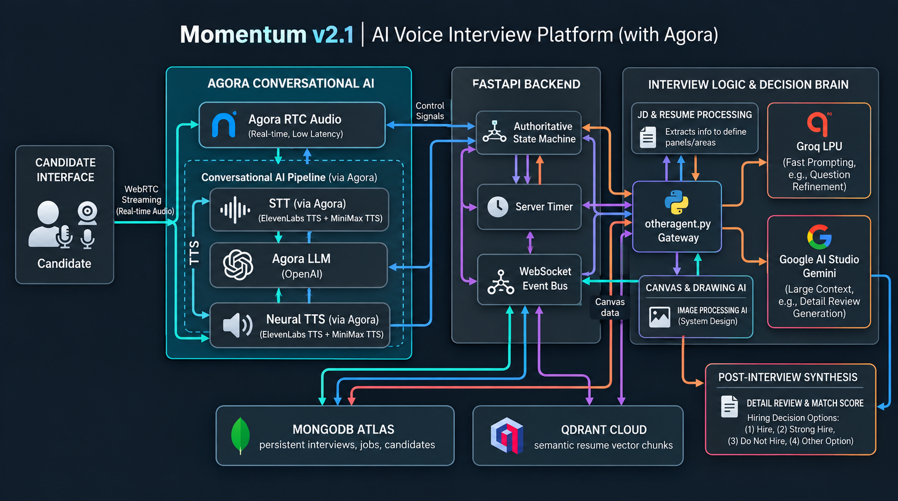

### Version 2.1 System Architecture Flowchart (Mermaid)

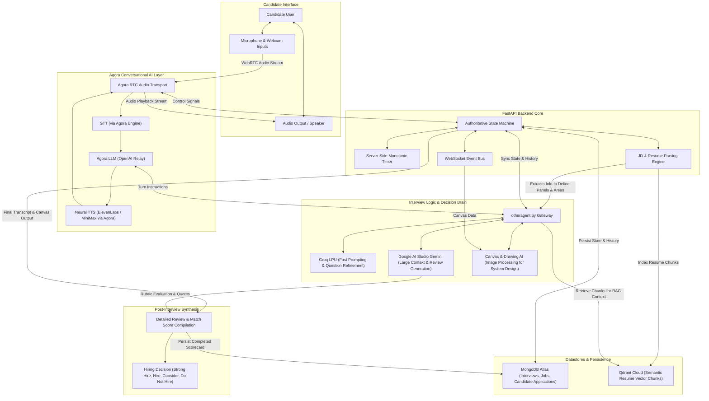

---

## 2. Momentum Version 2.2 Enterprise Architecture (No-Agora Internal Pipeline)

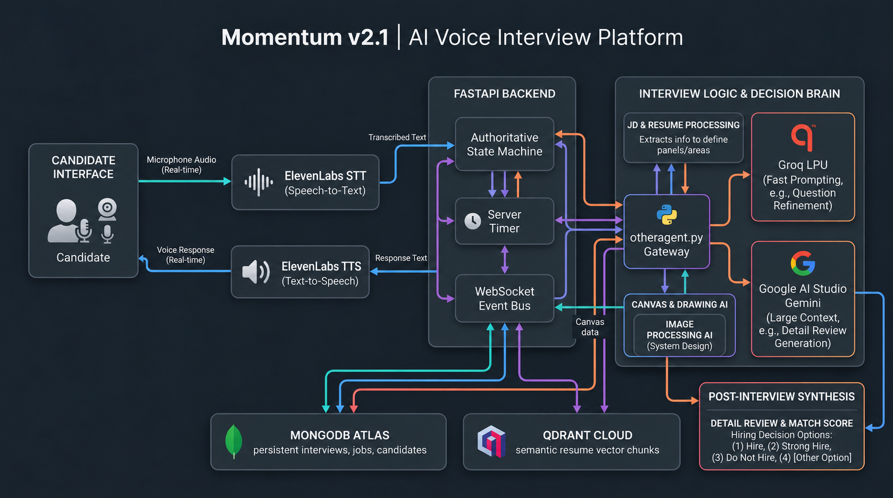

### Version 2.2 System Architecture Flowchart (Mermaid)

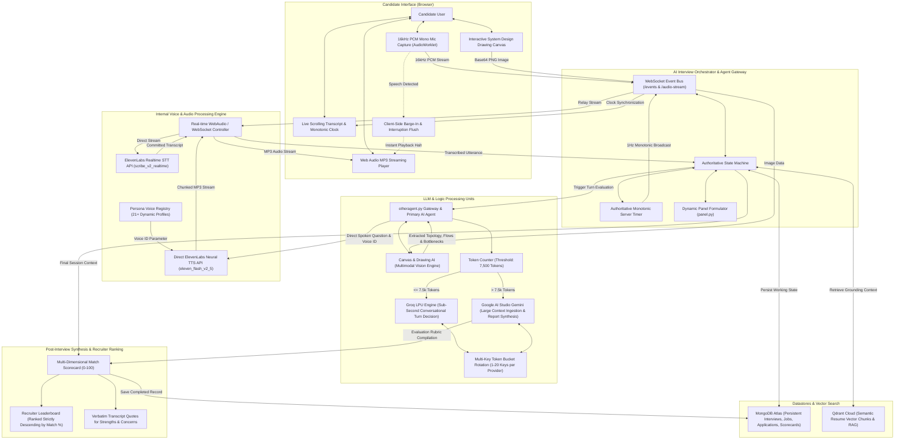

---

## 3. Multi-Agent LLM Routing Hierarchy (`otheragent.py`)

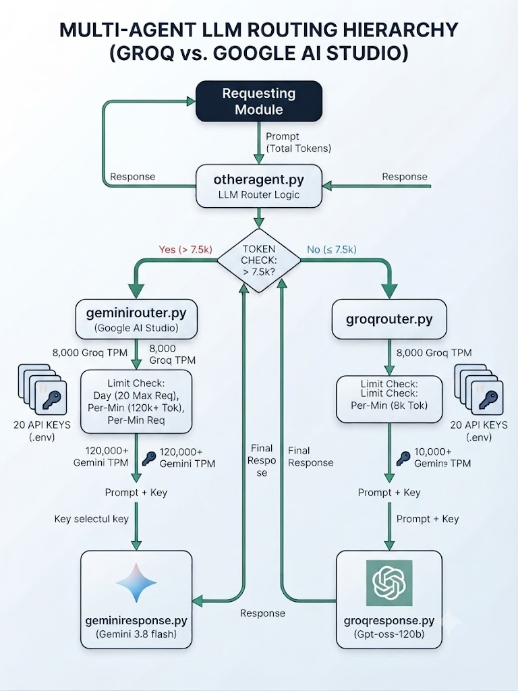

### LLM Router Flowchart (Mermaid)

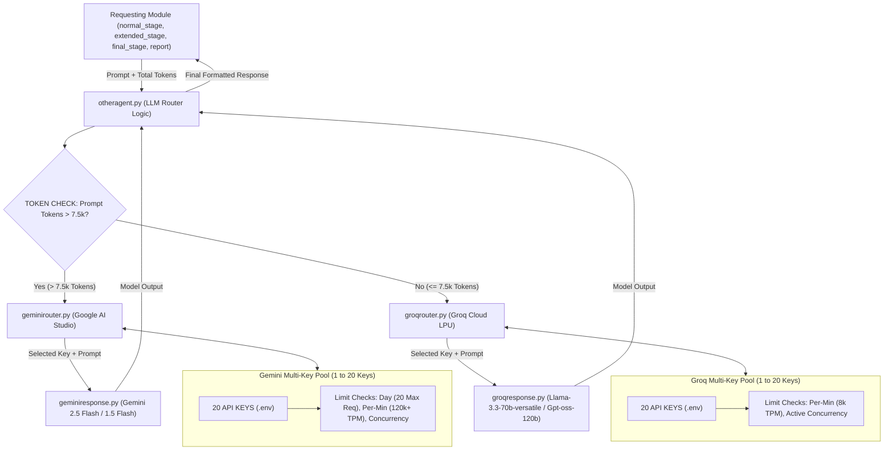

---

## 4. Architectural Comparison: Version 2.1 vs Version 2.2

| Architectural Dimension | Version 2.1 (Agora Foundation) | Version 2.2 (Internal No-Agora) |
|---|---|---|
| **Audio Transport Layer** | Agora RTC Engine & WebRTC Relay (Cost-Intensive) | Native HTML5 Web Audio API (16kHz PCM mono) + FastAPI WebSocket Relay (Zero-Telephony Cost) |
| **Speech-to-Text (STT)** | Agora STT Gateway | Direct ElevenLabs Scribe Realtime STT (`scribe_v2_realtime`) with automatic silence commit |
| **Text-to-Speech (TTS)** | Neural TTS relayed via Agora | Direct ElevenLabs Flash v2.5 (`eleven_flash_v2_5`) with 21+ assigned voice profiles |
| **Conversational Latency** | ~2.5 - 3.5s due to Agora bridging hops | Sub-second turn decisions (~0.7 - 1.2s end-to-end) |
| **LLM Router Hierarchy** | Ad-hoc routing calls | Formalized `otheragent.py` token threshold router (`<= 7.5k` Groq LPU vs `> 7.5k` Gemini) |
| **Rate Limit Protection** | Single key per provider | Dynamic Multi-Key Token Bucket Pool rotating 1 to 20 API keys per provider |
| **Visual Architecture Tool** | Conceptual text prompts | Interactive System Design Canvas with Multimodal Vision Engine analyzing base64 PNGs |
| **Timer Integrity** | Client-initiated timer | Server-authoritative monotonic timer starting strictly on `question_started` playback |
| **Barge-In Handling** | Agora speech detector | Sub-150ms client-side Web Audio buffer flush on candidate voice onset |
| **Recruiter Scoring** | Text evaluation summaries | Validated multi-dimensional scorecards with verbatim transcript quote grounding |

---

## 5. Platform Interface Showcase

### Candidate Portal and Job Application
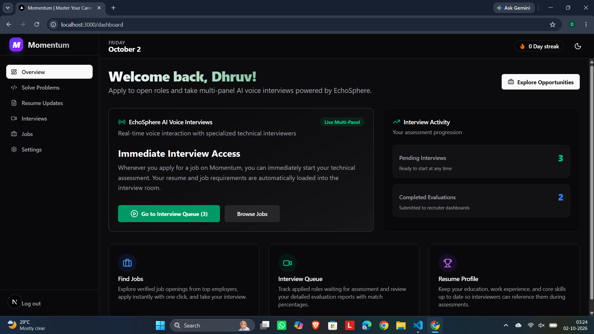
*Candidate browsing verified company job requisitions with dynamic interview parameters.*

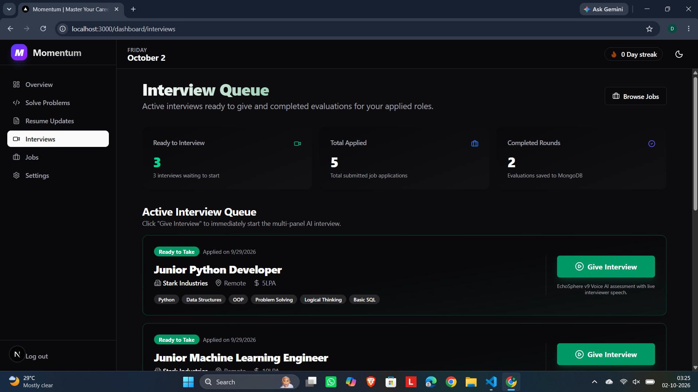
*Structured candidate profile extracting experience, skills matrix, and project history.*

### Pre-Flight Device Lobby & Live Interview Room
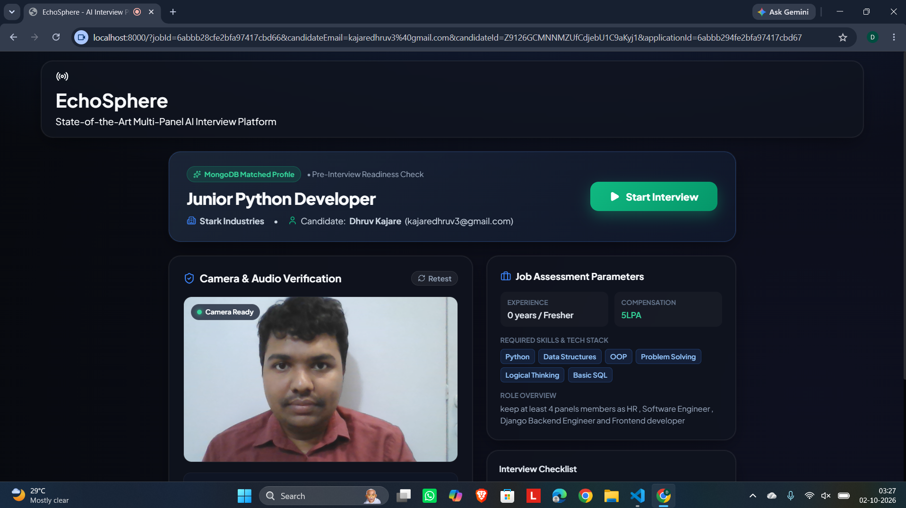
*Hardware verification lobby testing camera feed, Web Audio microphone levels, and disclosing AI evaluation.*

*Lead Technical Interviewer probing distributed systems and caching invalidation with real-time audio playback.*

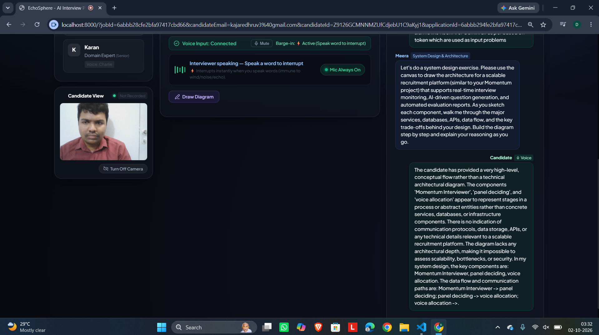
*Interactive architectural canvas for sketching microservice topologies evaluated by the Multimodal Vision Engine.*

### Recruiter Leaderboard and Scorecard Breakdown
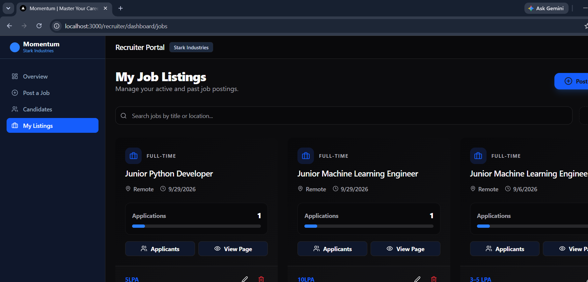
*Recruiter dashboard arranging all interviewed candidates in strictly descending order of overall match score.*

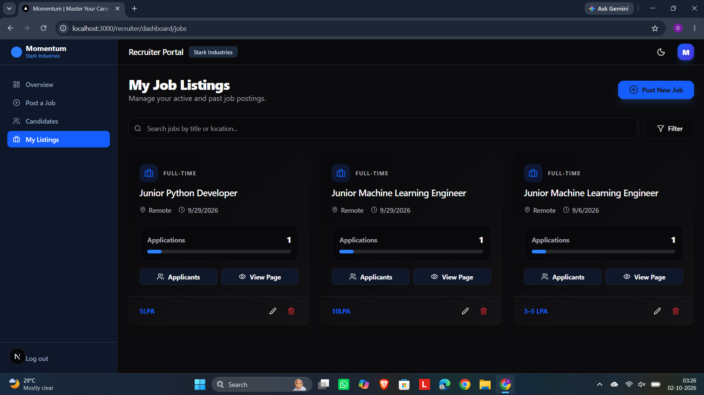
*Multi-dimensional candidate scorecard detailing strengths, concerns, and hire recommendations with transcript quotes.*
