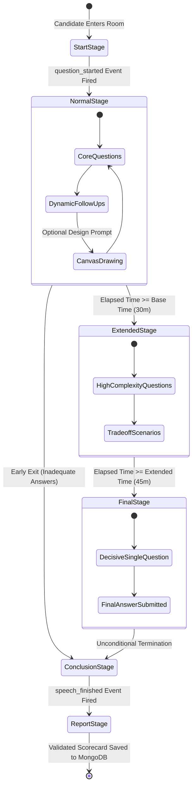
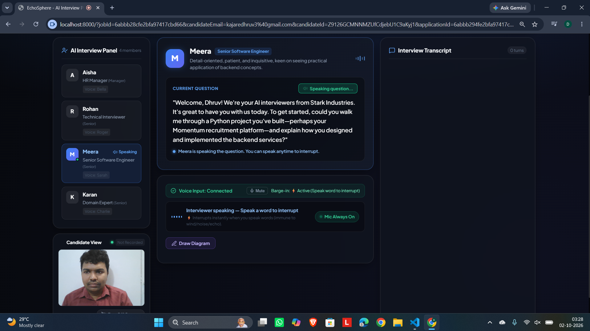
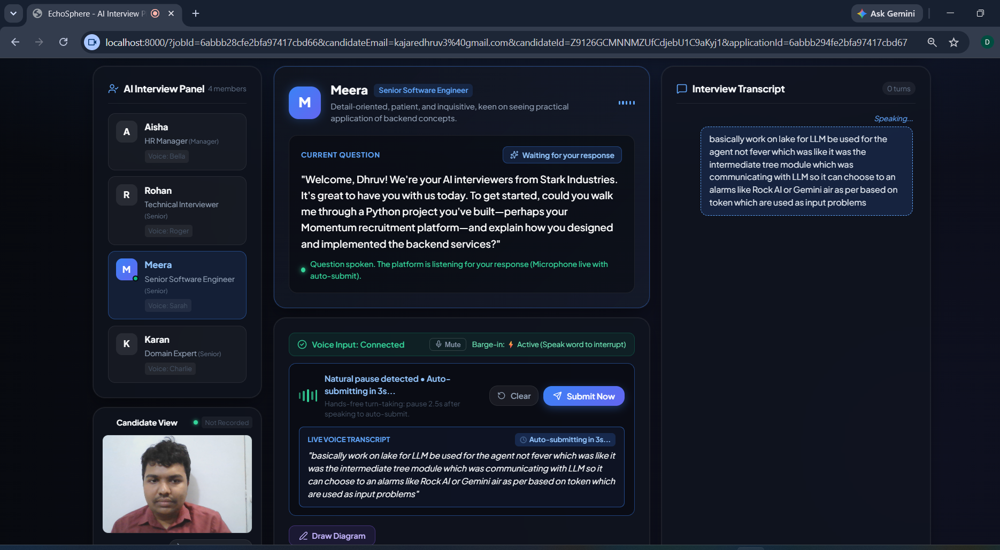
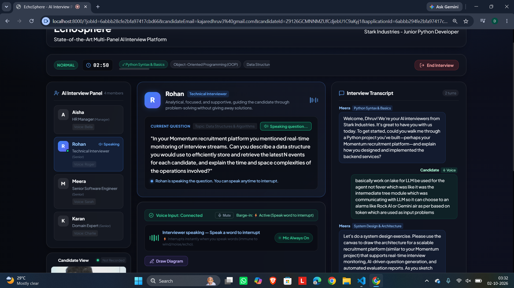
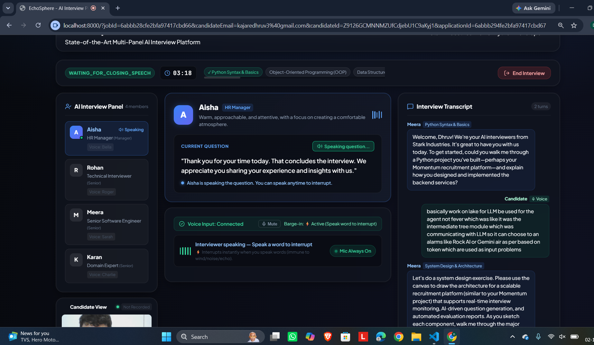
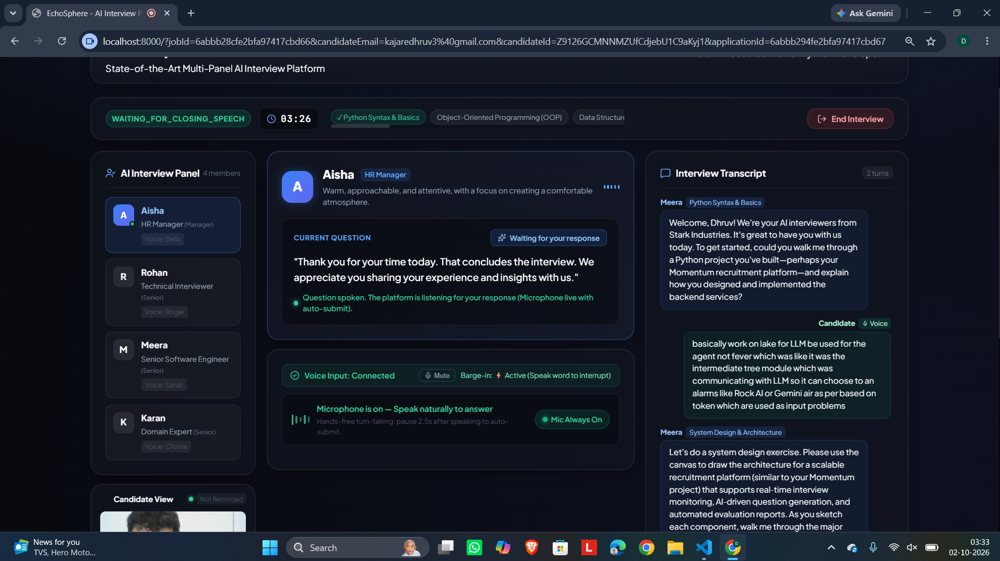

# Adaptive Multi-Stage Interview Lifecycle

## Executive Overview

The Momentum V2 interview engine orchestrates an adaptive, structured 6-stage lifecycle progression. Rather than following a predetermined questionnaire, the system dynamically adjusts question complexity, speaker roles, and evaluation depth based on the candidate's real-time performance and elapsed server time.

---

## 6-Stage Lifecycle State Machine

---

## Detailed Stage Analysis

### 1. Start Stage (Session Initialization & Opening Greeting)

- **Objective**: Establish rapport, introduce the dynamic panel, and present the opening question.
- **Workflow**:
  - The backend ingests the candidate resume and job criteria from MongoDB.
  - Instantiates the dynamic panel and selects the opening speaker (typically HR Manager Bella).
  - Prepares the opening spoken greeting via ElevenLabs Neural TTS.
- **Timer Mechanism**: The authoritative server clock remains idle until the browser emits `question_started`, indicating that the candidate's audio player is actively playing the greeting.

---

### 2. Normal Stage (Core Competency & Technical Validation)

- **Active Window**: `0 <= elapsed_time < base_time` (Default: 30 minutes).
- **Focus**: Core technical competencies, project validation, behavioral alignment, and foundational engineering principles.
- **Autonomous Probing Loop**:
  - Candidate responds via microphone.
  - ElevenLabs Realtime Scribe STT transcribes speech to text.
  - Groq LPU evaluates answer depth against the competency matrix.
  - If answers lack depth, targeted follow-ups are generated.
  - If a topic is validated, the floor is handed to the next appropriate panel member.
- **System Design Canvas**: The Lead Architect can trigger the drawing canvas for architectural topology sketches.

---

### 3. Extended Stage (High-Complexity Probing & Trade-Offs)

- **Active Window**: `base_time <= elapsed_time < extended_time` (Default: 30 to 45 minutes).
- **Focus**: Production incident response, distributed concurrency, cache stampede mitigation, failure recovery, and cross-functional business trade-offs.
- **Cross-Examination**: Panel members cross-examine the candidate, challenging pure technical implementations with business constraints.

---

### 4. Final Stage (The Decisive Challenge)
- **Active Window**: `elapsed_time >= extended_time` (Default: 45+ minutes).
- **Enforcement Rule**: The reasoning engine permits **strictly ONE decisive question** designed to test maximum candidate capability.
- **Termination**: Once the candidate submits their answer, the interview concludes unconditionally.

---

### 5. Conclusion Stage (Closing Remarks)

- **Objective**: Deliver professional closing remarks and thank the candidate for their time.
- **Workflow**: Selected panel member delivers closing remarks via ElevenLabs Neural TTS. The system waits for client-side `speech_finished` event before compiling the final evaluation report.

---

### 6. Evaluation Report Stage (Scorecard Synthesis & Persistence)

- **Objective**: Synthesize objective, evidence-backed evaluation scorecards.
- **Workflow**:
  - Full transcript, timestamps, and canvas analyses are dispatched to Gemini via `otheragent.py`.
  - Computes numeric scores (0-100) across overall match, technical competence, problem-solving, and communication.
  - Generates concrete strengths, concerns, and hire/reject reasons backed by exact transcript quotes.
  - Persists the validated report to MongoDB and updates the recruiter candidate leaderboard in strictly descending score order.
