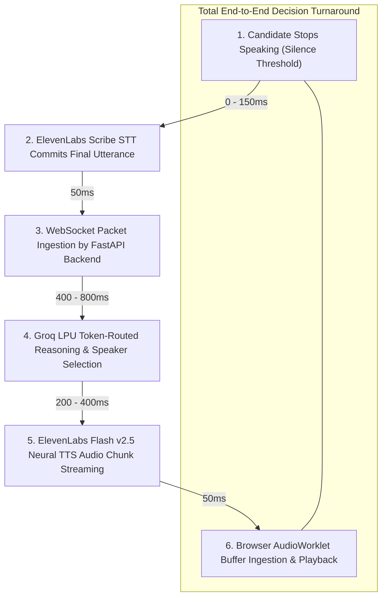
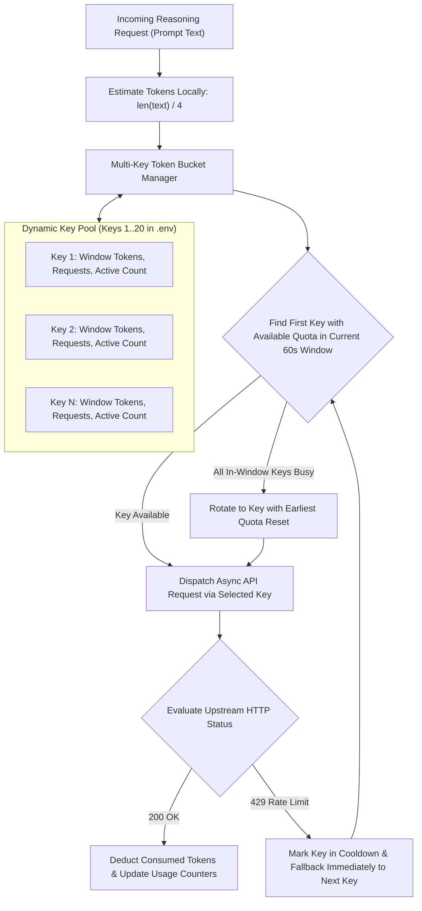
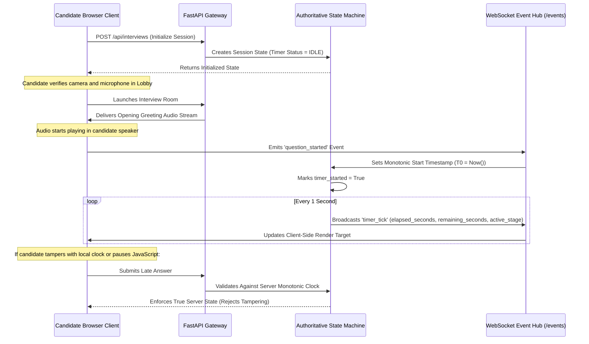
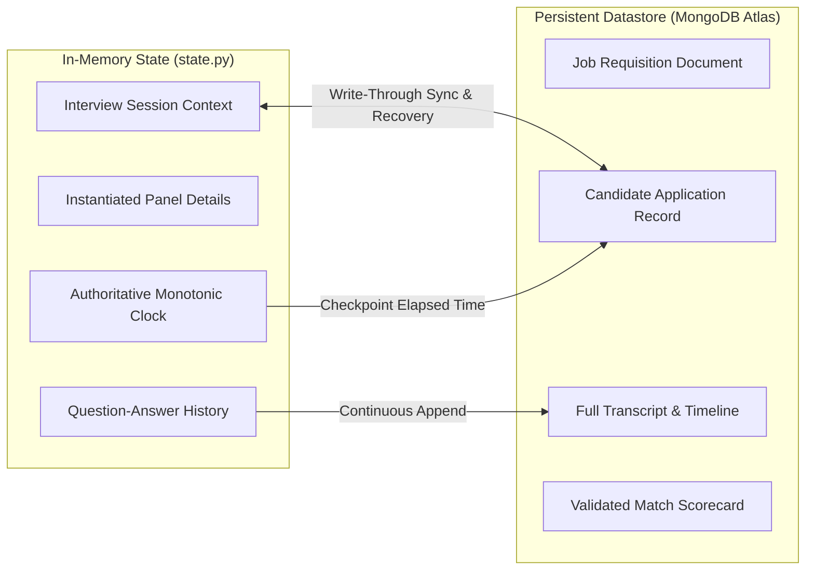

# Momentum V2 System Design and Engineering Principles

## System Design Objectives

1. **Ultra-Low Decision Latency**: Sub-second conversational turnaround between candidate speech completion and panel response generation.
2. **High Availability and Fault Tolerance**: Automated mitigation of third-party API rate limits and connection drops.
3. **Evaluation Integrity**: Deterministic, server-authoritative stage transitions and tamper-resistant countdown timers.
4. **Data Privacy**: Complete isolation of candidate voice, transcripts, and credentials.

---

## 1. Latency Breakdown and Optimization Pipeline

### End-to-End Latency Profile
- **Standard Cloud Environment**: ~1.2 to 1.8 seconds total turnaround (accounting for multi-key quota verifications and network hops).
- **Dedicated Enterprise Environment**: ~0.7 to 1.0 second total turnaround with direct persistent connections.

---

## 2. Resilient Multi-Key Token Bucket Architecture

To prevent API rate limit failures (HTTP 429) during peak concurrency without requiring prohibitive single-key enterprise tiers, Momentum implements a custom token-bucket key manager (`groqrouter.py` and `geminirouter.py`):

---

## 3. Server-Authoritative Timer & Monotonic Clock Synchronization

### Tamper Resistance Guarantees
- The client-side UI acts purely as a passive render target for timer events.
- If a candidate manipulates system clock settings or pauses JavaScript execution, the backend rejects late responses and enforces stage boundaries based strictly on the server's monotonic clock.
- Page reloads reconnect to `/api/interviews/{interview_id}/events` and resume displaying the exact elapsed time recorded on the server.

---

## 4. State Persistence and Fault Tolerance

The interview state machine (`state.py`) stores full runtime context in memory with write-through persistence to MongoDB:

- **Fault Tolerance**: If the backend service restarts during an active interview, the session state is reconstituted from MongoDB without loss of historical turns or elapsed monotonic time.
